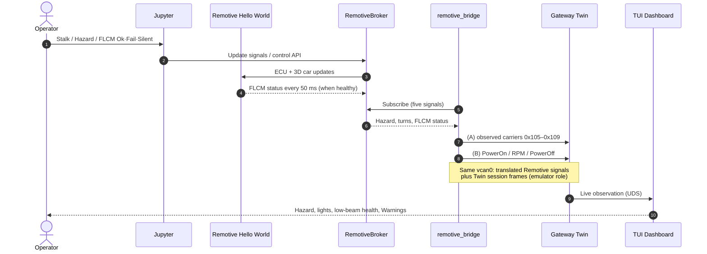

# SDV Simulation — Remotive Topology interacting with Car's Digital Twin

A Rust Digital Twin that **watches** a RemotiveCar Hello World vehicle in real
time—and catches lamp-ECU faults the 3D “cute car” never sees.

| | |
|---|---|
| **This repo** | [`sdv_simulation_remotive`](https://github.com/nsengupta/sdv_simulation_remotive) |
| **Capstone Twin (Simulation 5)** | [`sdv_simulation_5`](https://github.com/nsengupta/sdv_simulation_5) |
| **Capstone blog** | [Prototype SDV — milestone 1](https://nsengupta.github.io/blog/prototype-software-defined-vehicle-milestone-1/) |
| **Remotive examples** | [`remotivelabs-topology-examples`](https://github.com/remotivelabs/remotivelabs-topology-examples) |
| **Remotive demo branch** | `demo/flcm-lamp-status-feedback` (PR offered upstream) |

---

## Start here (about two minutes)

**If you came from the blog** (product / narrative lens), read in this order:

1. [Objective](#objective)
2. [What this proves](#what-this-proves) — including the demo punchline
3. [Why the Twin bridge?](#why-the-twin-bridge-component-name-remotive_bridge)
4. [Intentionally left out](#intentionally-left-out)

**If you are evaluating the engineering** (architecture / risk lens), these may be useful:

5. [How the pieces fit](#how-the-pieces-fit)
6. [What we changed](#what-we-changed)
7. [Deeper reading](#deeper-reading) for design contracts and run steps
8. [How to run](#how-to-run).

---

## Objective

This exercise shows that we can:

- Attach a **Rust Digital Twin** to a live **Remotive** vehicle topology (a _Twin-Bridge_ , see 
  below)
- Observe driver and ECU signals **in real time** (hazard, turn requests, front
  low-beam *status*).
- Detect when the front-lamp ECU reports **Fail**, or goes **silent** (stops
  publishing status).
- Warn on a Twin dashboard **without** rewriting Remotive’s BCM logic or the
  3D car’s visuals.
- Keep Remotive as the **authoritative vehicle model**, and the Twin as the
  **authoritative observer** of selected signals and faults.

---

## Why the Twin bridge (component name: `remotive_bridge`)?

Remotive's **Hello World** topology already runs alongside a **RemotiveBroker**—a signal hub that
carries Jupyter inputs and ECU outputs as named values over gRPC. That hub ships
with Remotive’s topology; we are just making use of its facilities.

What *we* added is **`remotive_bridge`**: a small Rust process on the Twin side
of that hub. It has a **dual role**.

1. **Translate Remotive → Twin.**  
   It uses RemotiveBroker (via `remotivelabs-broker`) to subscribe to selected
   signals—hazard, turn requests, FLCM low-beam status—and maps them onto Twin
   SocketCAN carriers (`0x105`–`0x109`). Remotive keeps speaking Remotive; the
   Twin keeps speaking its own CAN vocabulary.

2. **Replace the capstone emulator for this demo.**  
   In [Simulation 5](https://github.com/nsengupta/sdv_simulation_5), a separate
   **emulator** drove Twin lifecycle and motion on CAN (`PowerOn`, RPM,
   `PowerOff`). The Twin FSM is sensitive to that order. Remotive does not emit
   those Twin-specific frames, so the bridge **also generates** them—so Gateway
   can start, idle, and stop without the old emulator process.

```text
  Operator / Jupyter / 3D car
            │
            ▼
      RemotiveBroker          (already in Remotive topology)
            │
            ├──► Remotive ECUs (BCM, FLCM, …)
            └──► remotive_bridge ──┬── (A) translated ECU signals
                                   │      hazard / turns / FLCM status
                                   │      → Twin CAN 0x105–0x109
                                   │
                                   └── (B) Twin session frames
                                          PowerOn / RPM / PowerOff
                                          (emulator role)
                                            │
                                    ┌───────┴───────┐
                                    ▼               ▼
                              Gateway Twin     (same vcan0)
                                    │
                                    ├── child actors (SCCM, BCM, FLCM, …)
                                    ├── brain FSM (coordinates + PowerOn/Off)
                                    └── observation → TUI
```

Both (A) and (B) arrive on the Twin’s CAN interface. The Gateway does not see
“broker messages”—it sees **two kinds of Twin CAN input** from the bridge:
observed ECU traffic, and the lifecycle/motion frames that used to come from
the capstone emulator.

The broker is the **shared signal bus** Remotive already provides. The bridge is
**why the Twin can attach** without scraping containers or teaching Gateway to
speak gRPC.

---

## What this proves

| Claim | In practice |
|-------|-------------|
| Broker → Rust is a clean seam | `remotive_bridge` subscribes over gRPC and stays connected while the topology runs |
| Selected signals reach Twin state | Hazard, turn requests, and FLCM low-beam status appear as Twin context |
| Two views of the same car | Jupyter / 3D car *and* the TUI stay coherent on hazard and turns |
| Hazard stays readable after a pulse | A short Restbus “press” still leaves TUI **Hazard: ON** (see note below) |
| FLCM health is Twin-visible | Ok / Fail on attended low-beam rows; Warning on the Notice line |
| **FLCM silence** is a fault | If FLCM stops publishing low-beam **status** for **~500 ms**, the Twin warns and marks status stale |
| Cute car can look healthy while Twin warns | Low beams stay ON from BCM *requests* even when FLCM Fail / Silent |
| Twin does not drive Remotive | No Twin→broker publish on this path |
| There is a durable trail | Versioned observation files + live UDS (or Zenoh) |

> **Note — hazard latch.** Remotive’s hazard button on the bus is often a
> *momentary* pulse. Drivers expect “hazards are on” until they press again.
> The Twin therefore latches an internal **hazard mode** from rising edges of
> the button signal, so the TUI (and the story) match that expectation while
> the 3D car still blinks from BCM.

### Demo punchline (verified live)

With Jupyter buttons **FLCM Ok | Fail | Silent** and Hazard `!`:

1. Light stalk       → **Low Beam** → cute car ON; TUI low beams OK  
2. **FLCM Fail**     → TUI Warning + FAIL; cute car **still ON**  
3. **FLCM Ok**       → Warning clears  
4. **FLCM Silent**   → within ~500 ms Warning / stale; cute car **still ON**  
5. **FLCM Ok**       → healthy again  
6. Hazard **`!`**    → cute car blinks; TUI Hazard ON (latched)

### Why that contrast matters

> **The Twin is a real twin — not a mirror of the webpage.**
>
> It keeps tab on what ECUs are saying on the car’s bus, not only on what the
> physical (or 3D) manifestation paints. The cute car can still look bright from
> BCM *requests* while FLCM has already failed or gone silent. The Twin holds
> the **global, summated state** of the vehicle from those observations, and
> the _Warning_ is that summary speaking.
> 
> In a way, that's the **main objective of this exercise**.
> 

---

## How the pieces fit



We treat RemotiveBroker as the **shared signal bus** Remotive already provides.
The Twin attaches beside the vehicle model—it does not replace Remotive’s ECUs,
and it does not reach into their containers.

### Actors and the brain FSM

Inside Gateway, the Digital Twin is an **actor tree**:

- **Child actors** hold the current observed state of individual ECUs / domains
  (for this demo: SCCM, BCM, FLCM, and related contexts).
- A **brain FSM** coordinates those actors and applies superseding lifecycle
  signals such as **PowerOn** / **PowerOff** (and motion via RPM) so the twin
  session starts, runs, and stops in a coherent order.

That is why the bridge’s dual role matters: without ordered session frames,
the FSM never enters a state where ECU observations can accumulate into the
global twin view the TUI shows.

---

## What we changed

### On Remotive (`demo/flcm-lamp-status-feedback`, PR offered upstream)

| Change | Why |
|--------|-----|
| DBC `LowBeamLightStatus` from FLCM (50 ms, Ok/Fail) | Give the lamp ECU a voice |
| Small FLCM stub + `flcm_fault` (`ok` / `fail` / `silent`) | Cyclic status + demo inject |
| Hello World wires that stub (no empty `FLCM: {}`) | Status actually appears on the broker |
| Jupyter **FLCM Ok / Fail / Silent** | Operators can run the punchline without scripts |

BCM beam policy and the cute-car mapping stay on **BCM requests**—on purpose.

### In this Twin repo

| Piece | Role                                                                                                                                                                                                   |
|-------|--------------------------------------------------------------------------------------------------------------------------------------------------------------------------------------------------------|
| `remotive_bridge` | Dual role: translate RemotiveBroker signals → Twin CAN, and replace the capstone emulator’s PowerOn / RPM / PowerOff (see [Why the Twin bridge?](#why-the-twin-bridge-component-name-remotive_bridge)) |
| Twin actor tree + brain FSM | Child actors track ECU/domain state; the Brain actor - along with the FSM - coordinates them and lifecycle                                                                                             |
| Twin `FlcmContext` + silence watchdog | Treats missing FLCM **status** traffic (after first sighting) as a fault                                                                                                                               |
| Observation schema **v8** | Publishes FLCM health and events for TUI and files                                                                                                                                                     |
| TUI | Front Light (L)/(R), Low Beam (L)/(R), Warning Notice                                                                                                                                                  |

---

## Intentionally left out

- The Twin does **not** publish commands back into RemotiveBroker.
- BCM, GWM, and the cute car are **not** taught to consume FLCM status.
- Headlamp ACK/NACK machinery is **not** reused for FLCM Fail or silence.
- The legacy emulator and headlamp/wiper actuator binaries are **not** required
  for the Remotive demo (they remain only for the Simulation 5 CAN path).
- Richer ECU stories (rear-lamp reply checks, brake E2E timeouts, environment
  from ECUs, Twin-driven continuous stimulus) are **deferred** on purpose.

---

## How to run

Full commands and notes:
[`docs/DESIGN-remotive-observation.md`](docs/DESIGN-remotive-observation.md)
(§ Operator runbook).

**Order:** RemotiveBus → topology build → compose → Gateway → TUI → bridge →
Jupyter **Restart & Run All**.

**Stop:** Ctrl+C bridge / Gateway / TUI → compose `down` → stop RemotiveBus.

---

## Deeper reading

| Document | Audience |
|----------|----------|
| [`docs/DESIGN-remotive-observation.md`](docs/DESIGN-remotive-observation.md) | Contracts, identities, runbook |
| [`docs/DESIGN.md`](docs/DESIGN.md) | Simulation 5 Gateway / observation core |
| [`docs/design-documents.md`](docs/design-documents.md) | Catalogue |
| [Capstone blog](https://nsengupta.github.io/blog/prototype-software-defined-vehicle-milestone-1/) | Why the Twin exists at all |
| [`sdv_simulation_5`](https://github.com/nsengupta/sdv_simulation_5) | Parent Twin without Remotive |

---

## Crates (Remotive path)

| Crate | Role |
|-------|------|
| `remotive_bridge` | Broker subscribe → Twin CAN + session lifecycle |
| `gateway` | Digital Twin; observation tee; live UDS/Zenoh |
| `tui_dashboard` | Observation-only UI |
| `common` / `observation` | Twin state + schema v8 envelopes |
